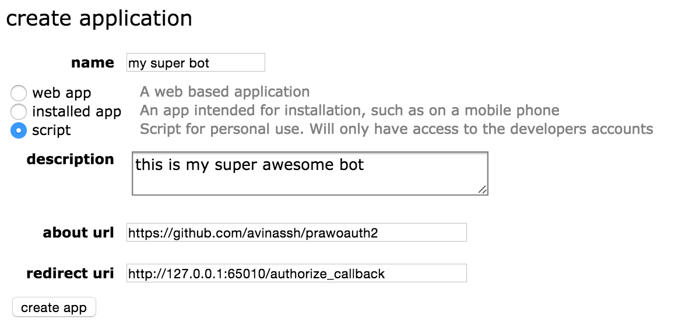

# prawoauth2

`prawoauth2` is a helper library which makes writing Reddit bots/apps using OAuth2 super easy and simple.

## Installation

    pip install prawoauth2

## How, What and Why?

`prawoauth2` comes with two components, `PrawOAuth2Mini` and `PrawOAuth2Server`. `PrawOAuth2Server` authorizes your app/script with the Reddit account and gives you access token. `PrawOAuth2Mini` uses these tokens for all next transactions with Reddit. Remember, for a bot, you only need `access_token`.

Why it is written like that? If you are writing a bot and running it on a headless server, something like Amazon AWS or Openshift, you cannot authorize your script with the Reddit account, as it tries to open the browser for authorization. This is one time only operation(if you pass the parameter `permanent`). So, I decided to break this into two parts. Run the `PrawOAuth2Server` locally on your computer, get the `access_token`, `refresh_token`  and save them somewhere. Later, `PrawOAuth2Mini` can make use of these tokens for further transactions. And it does not require browser at all, so that it can run in a headless server without any hiccups.

**TLDR;** `PrawOAuth2Server` meant to be run only once locally on your main machine to fetch the first `access_token`, `refresh_token` and `PrawOAuth2Mini` later and for everything. 

## Usage

### Running `PrawOAuth2Server`

For first time, as I mentioned earlier, you need fetch the `access_token`. So it is enough if you do the following only once. An instance of `PrawOAuth2Server` will run a server the moment you start it and it will be ready to handle requests from Reddit's OAuth Server. It basically captures the OAuth `code` from the redirect url, coming from Reddit.

0. First you need to register you bot/app on Reddit. The praw documentation already has a nice overview about [how](https://praw.readthedocs.org/en/v3.0.0/pages/oauth.html#step-1-create-an-application). Go [here](https://www.reddit.com/prefs/apps/) and here's what I recommend for a bot:
    
    
    
    Just make sure you are setting `redirect uri` to `http://127.0.0.1:65010/authorize_callback`. Rest doesn't matter. Once you have created the app, you will get `app_key` and `app_secret`. Copy them somewhere. These are credentials of your app, so make sure you keep them super secret and never ever commit them in git.

    

1. Import the required modules:
    
        import praw
        from prawoauth2 import PrawOAuth2Server

2. Create a praw instance
        
        user_agent = 'some string that uniquely identifies my bot'
        reddit_client = praw.Reddit(user_agent=user_agent)

3. Pass the `app_key` and `app_secret` of your app to the `PrawOAuth2Server` which will give you an instance to play with.

        oauthserver = PrawOAuth2Server(reddit_client, app_key, app_secret,
                                        state=user_agent)

4. Now, you need to start the oauth server, which runs internally. 

        oauthserver.start()

    The moment you start it, it opens the default web browser. If you are not logged in, log in with your bot account credentials and authorize the script (i.e. clicking on `accept`). This basically says, 'Hey Reddit, give access of my reddit account(your bot account) to this app(your script)'. This will be redirected back and will show you a `successful` message.

5. Once it is successful, you can get the tokens by calling `get_access_codes`.

        tokens = oauthserver.get_access_codes()

    The `tokens` is a `dict` type:

        >>> tokens
        {u'access_token': u'2...U', u'scope': set([u'identity']), u'refresh_token': u'2...s'}

### Using `PrawOAuth2Mini`

`PrawOAuth2Mini` will be used in your script always (unlike `PrawOAuth2Server`). It basically does two operations. First, it sets the praw instance with all the required credentials required for OAuth operation. The `access_token` expires for every 60 minutes (this is set by Reddit), so you can call `refresh` to get the new tokens. You don't really need to keep track of expiry time, when the tokens are expired, `OAuthInvalidToken` exception will be thrown. Catch it and do `refresh`. On the other hand, you can call the `refresh` before every operation, however it will get new tokens only when old ones are about to expire.

1. Just create an instance of `PrawOAuth2Mini` with all the required parameters.
    
        oauth_helper = PrawOAuth2Mini(reddit_client, app_key=app_key,
                              app_secret=app_secret,
                              access_token=access_token,
                              refresh_token=refresh_token, scopes=scopes)

        Note that `refresh_token` is not required here. Even if you just pass the `access_token`, it will work.

2. Call `refresh` before every operation or in catch block of `OAuthInvalidToken` exception

        oauth_helper.refresh()

Check the `examples` directory for examples.

## Bots using `prawoauth2`

- [Goodreads Bot](https://github.com/avinassh/Reddit-GoodReads-Bot)

Feel free to fork and add link to your bot/project.

## LICENSE
The mighty MIT License. Please check `LICENSE` for info.

## Credits
SmBe19's [praw-OAuth2Util](https://github.com/SmBe19/praw-OAuth2Util) and KissTheBlade_'s [script](https://github.com/x89/Shreddit/blob/master/get_secret.py) were very helpful. [These](https://www.reddit.com/r/redditdev/comments/3bit3y/prawoauth_how_do_i_make_an_automated_bot/) [Reddit](https://www.reddit.com/r/redditdev/comments/3bipzt/help_with_oauth/) [threads](https://www.reddit.com/r/redditdev/comments/197x36/using_oauth_to_send_valid_requests/) [also](https://www.reddit.com/r/redditdev/comments/2ujhkr/important_api_licensing_terms_clarified/) helped me lot.

First I started using `praw-OAuth2Util`, but I really did not like the way it was handling configurations and tokens. So, I [forked](https://github.com/avinassh/praw-OAuth2Util) and started using my fork. And later ended up writing my own. I am no longer maintaining the fork and I recommend using this library instead.