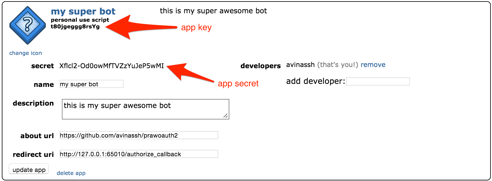

## Usage Guide

### Running `PrawOAuth2Server`

For first time, as I mentioned earlier, you need to fetch the `access_token` and a valid `refresh_token`. So it is enough if you do the following only once. An instance of `PrawOAuth2Server` will run a server the moment you `start` it and it will be ready to handle requests from Reddit's OAuth Server. It basically captures the OAuth `code` from the redirect url, coming from Reddit.

0. First you need to register your bot/app on Reddit. The praw documentation already has a nice overview about [how](https://praw.readthedocs.org/en/stable/pages/oauth.html#a-step-by-step-oauth-guide). Go [here](https://www.reddit.com/prefs/apps/) and here's what I recommend for a bot:
    
    
    
    Just make sure you are setting `redirect uri` to `http://127.0.0.1:65010/authorize_callback`. Rest doesn't matter. Once you have created the app, you will get `app_key` and `app_secret` (sometimes referred as `client_id` and `client_secret` respectively). Copy them somewhere. These are the credentials of your app, so make sure you keep them super secret and never ever commit them in git.

    

1. Import the required modules:
    
        import praw
        from prawoauth2 import PrawOAuth2Server

2. Create a praw instance
        
        user_agent = 'some string that uniquely identifies my bot'
        reddit_client = praw.Reddit(user_agent=user_agent)

3. Scopes specify what all permissions your app (or bot script) needs from user's Reddit account(or your bot account), like read private messages, spend gold credits etc. You can read about different scopes on praw's [official documentation](https://praw.readthedocs.org/en/stable/pages/oauth.html#oauth-scopes). Make sure you get the scopes correct or else your bot will fail. For example, if you want your bot to be able to make comments then it must have `submit` scope, along with with `identity` and `read`. Check the [examples directory](https://github.com/avinassh/prawoauth2/tree/master/examples) for to see how I am managing it. You need to send `scopes` param to `PrawOAuth2Server` (and also to `PrawOAuth2Mini`) and it is a list containing scopes:

        scopes = ['identity', 'read', 'submit']

4. Pass the `app_key` and `app_secret` of your app, along with the praw instance to the `PrawOAuth2Server` which will give you an instance to play with.

        oauthserver = PrawOAuth2Server(reddit_client, app_key, app_secret,
                                       state=user_agent, scopes=scopes)

5. Now, you need to start the oauth client server, which runs internally. 

        oauthserver.start()

    The moment you start it, it opens the default web browser. If you are not logged in, log in with your bot account credentials and authorize the script (i.e. clicking on `accept`). This basically says, 'Hey Reddit, give access of my reddit account(your bot account) to this app(your script)'. This will be redirected back, to the redirect url you specified earlier and will show you a `successful` message.

6. Once it is successful, you can get the tokens by calling `get_access_codes`.

        tokens = oauthserver.get_access_codes()

    The `tokens` is a `dict` type:

        >>> tokens
        {'access_token': '2...U', 'scope': set(['identity', 'read', 'submit']), 'refresh_token': u'2...s'}

### Using `PrawOAuth2Mini`

`PrawOAuth2Mini` will be used in your main bot script always (unlike `PrawOAuth2Server`). It basically does two operations. First, it sets the praw instance with all the required credentials required for OAuth operation. The `access_token` expires for every 60 minutes (this is set by Reddit), so you can do `refresh` operation to get the new tokens. You don't really need to keep track of expiry time, when the tokens are expired, `OAuthInvalidToken` exception will be thrown. Catch it and do `refresh`. On the other hand, you can call the `refresh` before every operation, however it will get you new tokens only when old ones are about to expire. Check the [`examples` directory](https://github.com/avinassh/prawoauth2/tree/master/examples) to see how I am handling it.

1. Just create an instance of `PrawOAuth2Mini` with all the required parameters:
    
        oauth_helper = PrawOAuth2Mini(reddit_client, app_key=app_key,
                                      app_secret=app_secret,
                                      access_token=access_token,
                                      refresh_token=refresh_token, scopes=scopes)

2. Call `refresh` before every operation and/or in catch block of `OAuthInvalidToken` exception:

        oauth_helper.refresh()

Check the [`examples` directory](https://github.com/avinassh/prawoauth2/tree/master/examples) for examples.